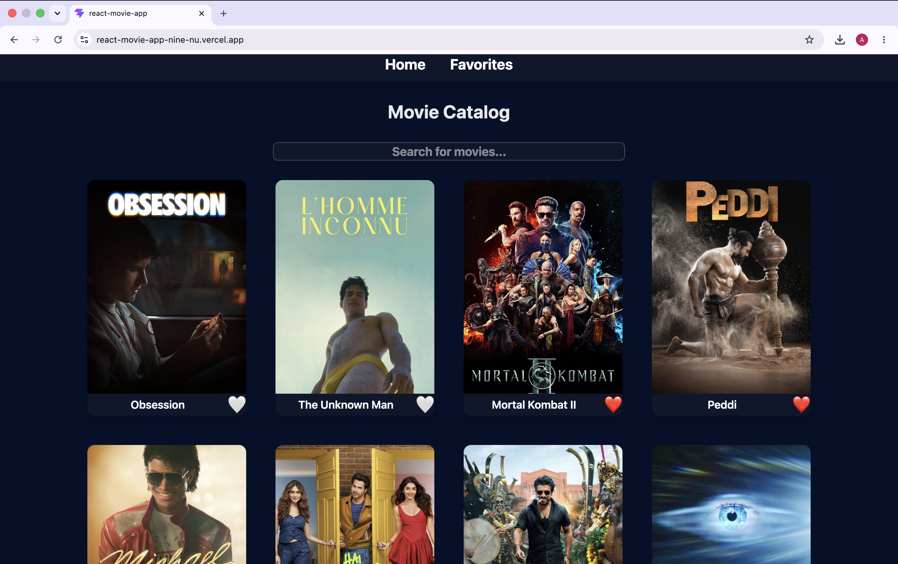
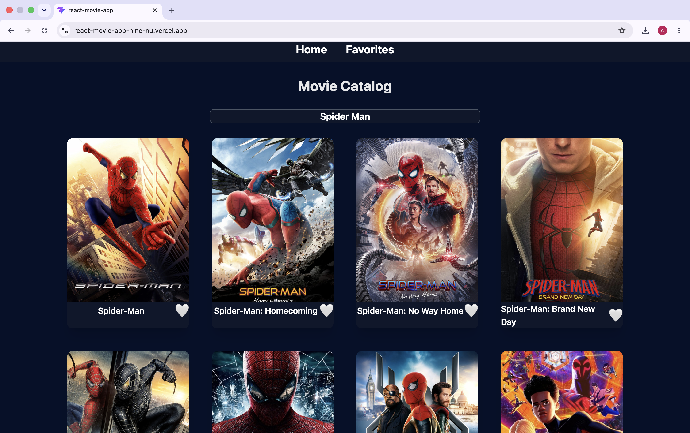
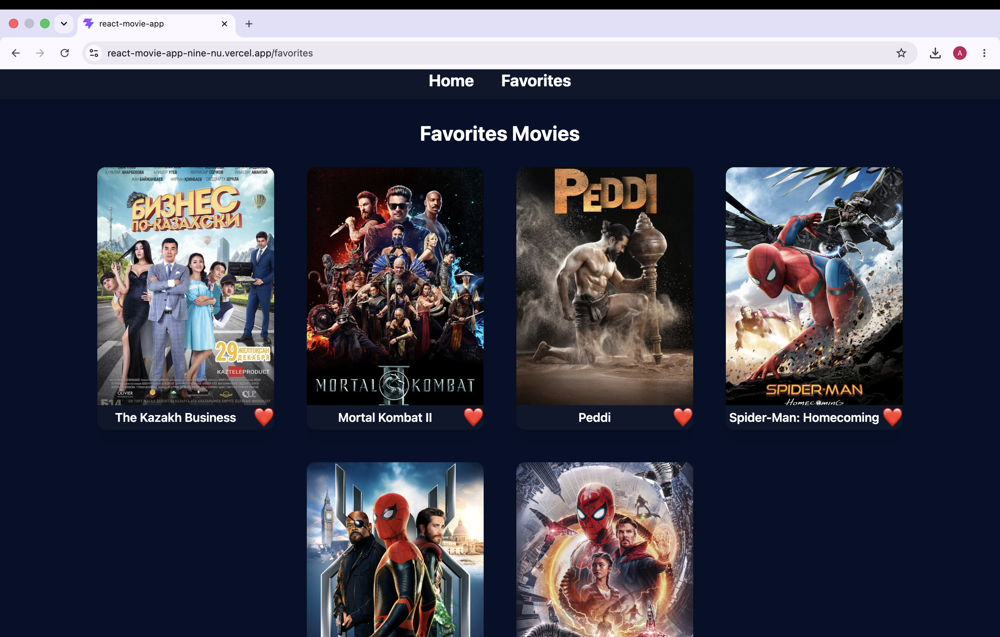
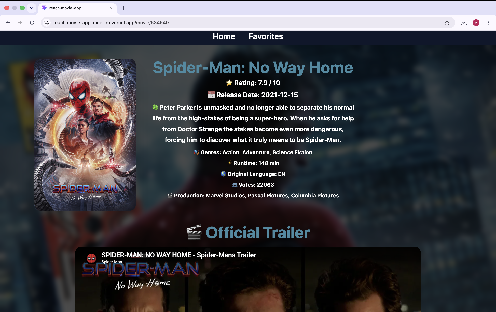
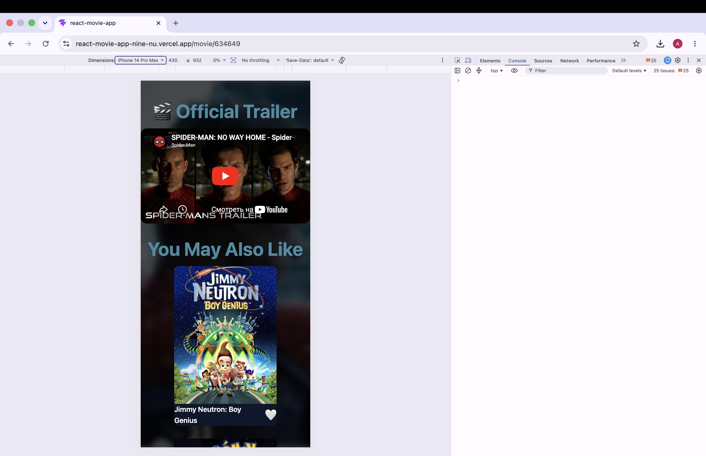

# 🎬 React Movie App

A modern movie discovery web application built with React and TMDB API.

## 🚀 Features

* Browse popular movies
* Search movies by title
* View movie details
* Responsive design for desktop and mobile
* Loading states and error handling
* Dynamic routing with React Router
* Modern UI built with Tailwind CSS
* API integration with TMDB

## 🛠️ Technologies Used

* React
* React Router DOM
* Tailwind CSS
* TMDB API
* Vite
* JavaScript (ES6+)

## 📸 Screenshots

### Home Page


### Search Results


### Favorites Page


### Movie Details


### Mobile View


## 📱 Responsive Design

The application is fully responsive and optimized for desktop and mobile devices.

## ▶️ Installation

```bash
git clone https://github.com/ga1ssaa/react-movie-app.git
cd react-movie-app
npm install
npm run dev
```

## 🌐 Live Demo

https://react-movie-app-nine-nu.vercel.app/

## 👨‍💻 Author

Developed by [Aldiyar Gaisa](https://github.com/ga1ssaa)

* GitHub: https://github.com/ga1ssaa
* LinkedIn: https://www.linkedin.com/in/ga1ssaa/